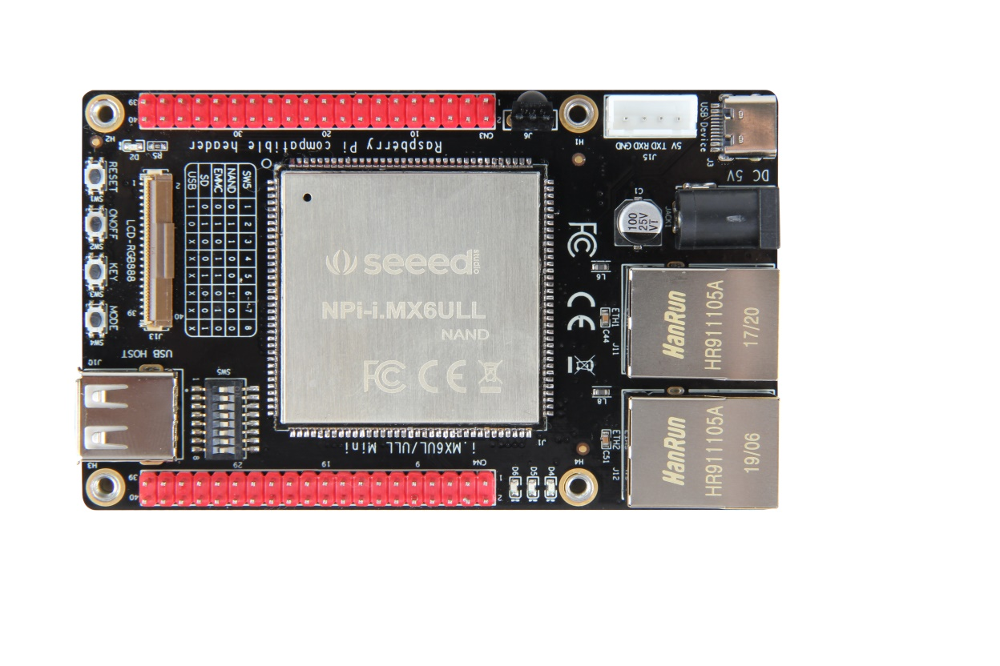

产品简介
--------

### 产品概述

EBF6ULL S1 Mini开发板是野火电子基于NXP i.MX
6ULL系列处理器设计的一款低功耗单板电脑，工业级主频最高可达 800MHz，具体见图
1‑1。

图 1‑1 EBF6ULL S1 Mini开发板正面

图 1‑2 EBF6ULL S1 Mini开发板背面

EBF6ULL S1
Mini开发板提供完整的SDK驱动开发包、核心板封装库，底板应用参考设计原理图，可帮助客户大大缩减产品的开发时间，加快产品上市。目前提供Linux
4.1.15版本的内核，配套的系统自带python、Qt等组件。

开发板整板由EBF6ULL S1核心板模组和底板组成，具体见图
1‑3，元件采用工业级选料，其中核心板板载主控芯片512MB SDRAM，256MB
NANDFLASH（或8GB eMMC）。

图 1‑3 EBF6ULL S1邮票孔核心板内部（eMMC版本）

底板PCB采用6层黑色沉金设计，单面放元件，整体尺寸100x62mm，共140个引脚，引脚间距1.0mm，除了SEMC总线没有引出，芯片其余IO均引出。该开发板适用于工业控制、手持扫码、喷墨打印机、轨道交通、无人机控制和音频输出等领域。

### 产品特性

#### 核心板参数

EBF6ULL S1核心板模组参数如下：

-   CPU：NXP MCIMX6Y2CVM08AB 处理器

-   频率：工业级最高可达800MHz

-   SDRAM：板载512MB SDRAM

-   NAND FALSH：板载256MB NAND FALSH（与eMMC二选一）

-   eMMC：板载8GB eMMC（与NAND FLASH二选一）

-   PCB：8层黑色沉金，尺寸为39 x39mm

-   封装：邮票孔封装，单面元件，背面没有元件，底板不需要挖槽

#### Mini底板参数

EBF6ULL S1 Mini底板参数如下：

-   以太网：2路，百兆以太网接口

-   电源： 5V±2%单电源供电

-   PCB：6层黑色沉金，尺寸为100x61.8mm

-   LCD接口：含24位RGB 接口及I2C触摸屏控制接口

-   USB Host接口：1路

-   USB OTG接口：使用Type C接口引出

-   RTC电池插槽：1个

-   SD卡槽：1路

-   红外接收头：1个

-   用户LED：3个

-   按键：4个，分别为复位、ON/OFF、普通按键及Mode模式切换按键

-   串口接口：1路

-   IO扩展：包含一个74LV595PW芯片，把某4路IO扩展成8路

-   拨码开关：一个8位拨码开关，支持切换NAND、eMMC、SD及USB启动方式

-   排针引脚：所有IO全部引出，包括GPIO引出107个，差分时钟一组，USB专用口2个，POR_B复位脚1个，电源控制口2个

#### 软件环境

EBF6ULL S1 Mini默认提供的软件环境如下：

-   操作系统：Linux 4.1.15

-   图形界面：Qt5.6

### 产品选型

EBF6ULL
S1邮票孔核心板包含NANDFLASH和eMMC两个版本，它们均能适配Mini底板，这两款核心板的具体差异见表格
1‑1。

表格 1‑1 EBF6ULL系列邮票孔核心板型号选型

| 型号     | EBF6ULL S1-NAND          | EBF6ULL S1-eMMC   |
|----------|--------------------------|-------------------|
| 主芯片   | MCIMX6Y2CVM08AB          | MCIMX6Y2CVM08AB   |
| 主频     | 800MHZ                   | 800MHZ            |
| 温度级别 | \-40°\~ +105°            | \-40°\~ +105°     |
| SDRAM    | 512MB，工业级            | 512MB，工业级     |
| FLASH    | 256MB，NANDFLASH，工业级 | 8GB，eMMC，工业级 |

引脚功能 
---------

EBF6ULL S1 Mini底板引出的排针接口功能见图 2‑1和图 2‑2。

图 2‑1 CN3排针接口原理图

图 2‑2 CN4排针接口原理图

机械尺寸 
---------

### 核心板尺寸

EBF6ULL S1核心板的尺寸为39×39mm，具体见图 3‑1。EBF6ULL
S1核心板可以作为一个模组嵌入到PCB底板中，为了减少用户在制作核心板的PCB封装时的尺寸误差，我们提供了核心板的DWG文件，在设计底板PCB时候，只需将我们提供好的核心板DWG文件导入到底板PCB即可。

图 3‑1 EBF6ULL S1邮票孔核心板尺寸图，单位mm

### Mini板尺寸

EBF6ULL S1 Mini底板尺寸为100×61.8mm，具体见图 3‑2。

图 3‑2 EBF6ULL S1 Mini底板尺寸图，单位mm

手册版本
--------

| 版本  | 时间       | 备注     |
|-------|------------|----------|
| V1.00 | 2019/08/17 | 创建文档 |

销售与服务网站
--------------

东莞野火电子科技有限公司

地址：东莞市大岭山镇石大路2号艺华综合办公大楼301

官网：[www.embedfire.com](http://www.embedfire.com)

电话：0769-33894118

论坛：[www.firebbs.cn](http://www.firebbs.cn)

邮箱：<firege@embedfire.com>

QQ：313303034

淘宝：<https://fire-stm32.taobao.com>

关注野火公众号，可免费获取野火全部产品的资料。
